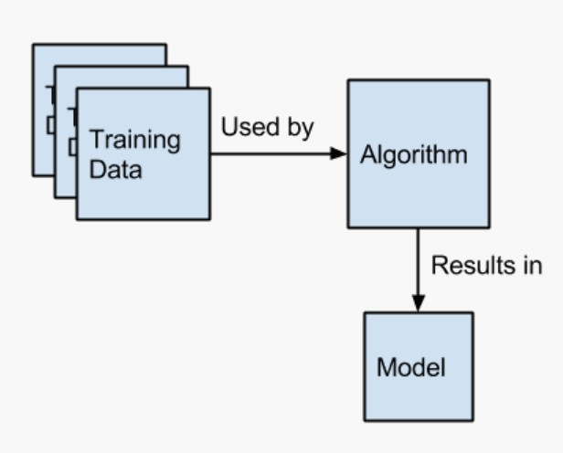

# Student Performance Predictions

<!--  -->

    

### Contributors 
Explore our contributors' other works and learn more about them. 

&#10024; [Mary Vang](https://github.com/Vang59)

&#10024; [Will Thomer](https://github.com/Siskeaux)

&#10024; [Kameron Thao](https://github.com/KThao17)

&#10024;[Nou Yang](https://github.com/nouyang0620)

# Overview of the Analysis
Using machine learning, we aim to analyze the various factors that can impact a high school student's academic performance. Our objective is to determine if there is a correlation between a student's circumstances and their overall performance on math, reading, and writing exams. Subsequently, we plan to develop a machine learning model that can predict a student's performance based on these features. 

#  Process 

    

* **Data:** [exams.csv](Resources/Student_DataType_Conversion.csv)
    * **Disclaimer:** To eliminate potential bias, ethnic groups have been anonymized. 
    * [Columns Reference](Images/NumericConversionReference.png)

* **Preprocessing:**
    * Labels (y): 
        * math score
        * reading score
        * writing score
    * Features (X):
        * gender
        * race/ethnicity
        * parental level of education
        * lunch
        * test preparation course
        * math score
        * reading score
        * writing score
    * train_test_split 
* **Algorithm:**
    * [RandomUverSampler](https://imbalanced-learn.org/dev/references/generated/imblearn.under_sampling.RandomUnderSampler.html)
    * [RandomOverSampler](https://imbalanced-learn.org/dev/references/generated/imblearn.over_sampling.RandomOverSampler.html)
    * [DecisionTreeRegressor](https://scikit-learn.org/stable/modules/generated/sklearn.tree.DecisionTreeRegressor.html)
    * [r2_score](https://scikit-learn.org/stable/modules/generated/sklearn.metrics.r2_score.html)

* **Math Score Prediction**

    

* **Reading Score Prediction**

    

* **Writing Score Prediction**

    

# Summary

* It is our conclusion that certain conditions do in fact impact a student's academic performance when it comes to exam scores. 
    * Gender: Female students have higher average exam scores in Reading and Writing however, Male students have higher average exam scores in Math.
    * Race/Ethnicity: Students belonging to the E group for race and ethnicity consistently have higher average scores in all subjects.
    * Parental Level of Education: Students with parents who completed only some high school consistently have lower average exam scores in all subjects.
    * Lunch Type: Students with standard lunch fees significantly scored more A letter grade exam scores in Math, Reading, and Writing versus those who receive free/reduced lunch.
    * Test Preparation Course: Students who completed a test preparation course consistently have the least failing exam scores and more A letter grade exam scores in all 3 academic subjects. 
* In summary, female students who belong to the E race group with parents who have some sort of college degree, have standard lunch fees, and complete a test preparation course are the students who can be predicted to be the higher performing students when it comes to Math, Reading, and Writing exam scores. 
* Conversely, male students who belong to the B race group with parents who only completed some high school, have free/reduced lunch, and do not complete a test preparation course are the students who can predicted to be the lower performing students when ti comes to Math, Reading, and Writing exam scores.

### References
Data for this dataset was generated by [roycekimmons.com/tools](http://roycekimmons.com/tools), and is intended for educational purposes only. 