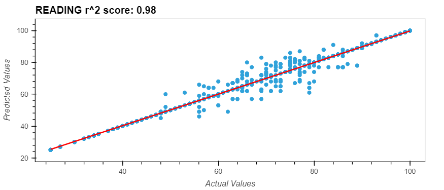

# Students-Performance-Predictions-

<!--  -->

    

### Contributors 
Explore our contributors' other works and learn more about them. 
* [Mary Vang](https://github.com/Vang59)
* [Will Thomer](https://github.com/Siskeaux)
* [Kameron Thao](https://github.com/KThao17)
* [Nou Yang](https://github.com/nouyang0620)

## Overview of the Analysis
Using machine learning, we aim to analyze the various factors that can impact a high school student's academic performance. Our objective is to determine if there is a correlation between a student's circumstances and their overall performance on math, reading, and writing exams. Subsequently, we plan to develop a machine learning model that can predict a student's performance based on these features. 

## Results
* **Libraries and methods**
    * Pandas
        * hvplot.pandas
    * Numpy 
    * imblearn.under_sampling
        * RandomUnderSampler
    * sklyearn.model_selection
        * train_test_split
    * sklearn.tree
        * DecisionTreeRegressor
    * sklyearn.metrics
        * r2_score 

* **Data Processing** 
    * **Disclaimer** To eliminate potential bias, ethnic groups have been anonymized. 
    * Labels (y): 
        * math score
        * reading score
        * writing score
    * Features (X):
        * gender
        * race/ethnicity
        * parental level of education
        * lunch
        * test preparation course
    * [Columns Reference](Images/NumericConversionReference.png)

* **Compiling, Training, and Evaluating the Model** 
    * Correlations: 

    * Math 
    

    * Reading
    

    * Writing 
    

## Summary

### References
Data for this dataset was generated by [roycekimmons.com/tools](http://roycekimmons.com/tools/generated_data/exams), and is intended for educational purposes only. 